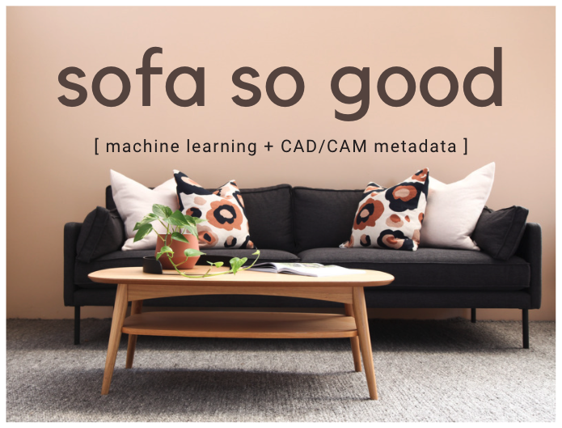
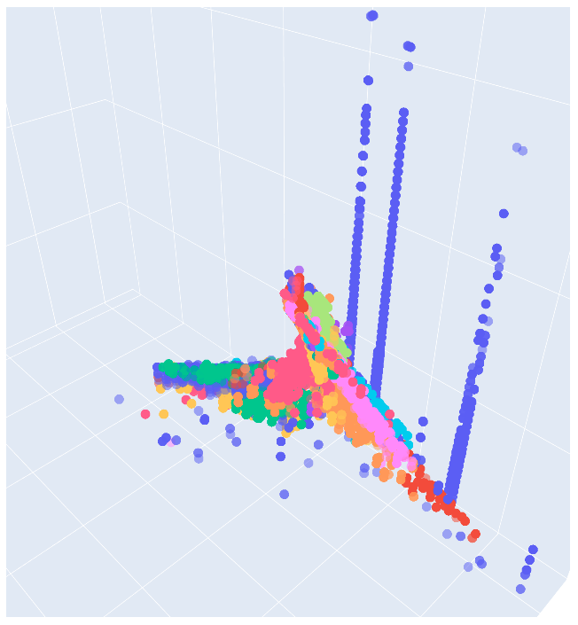

# Predictive ML for CAD/CAM Pattern Metadata

### Objective
The objective of this project is to understand how metadata from Gerber Accumark CAD/CAM systems can be used to classify objects based on characteristics such as perimeter, area, number of internal lines, etc. 

### Data
The data used in this project is from two separate manufacturer's CAD/CAM systems. Identifying information has been removed. Initially this data was unlabeled, but by using web scraping and NLP ngram techniques I was able to label the dataset and, therefore, assess performance. I have not pushed this code to the repository because it contains private information. Also, the datasets are extremely large, some having up to 6 million records. One smaller, sample set is available for view in the public repo.

### EDA

Intitial data exploration revealed the beginnings of separability. The visualization below was created using the smallest dataset, and looks promising. Data for visualizations was decomposed using incremental PCA, to conserve computational power.

more eda description here.

### Model Structure + Initial Findings
I ran 10 baseline classifiers on the first level of modeling and the performance ranged between ___ and ___ on the test sets.

[insert vanilla_models image here.]

However, due to the nature of the problem, this learning actually requires stacked models. Roughly, the form of the model is as illustrated:

[insert model structure illustration here.]

More about the nature of the final model here.

### Results

### Limitations

### Next Steps

### Repository Structure

### About the Author
