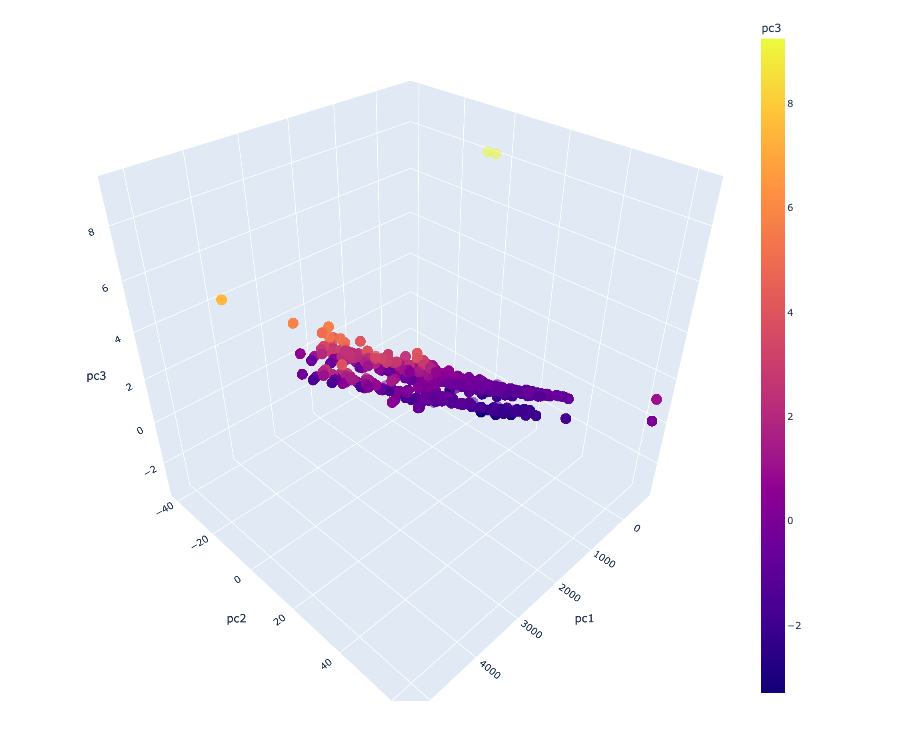
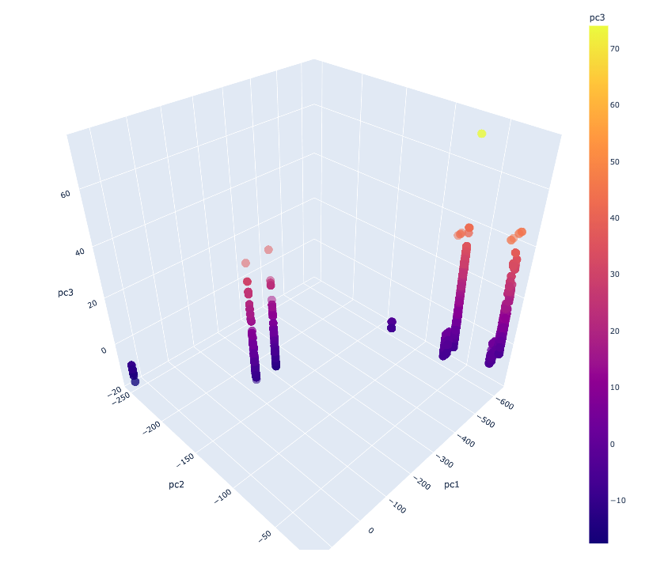
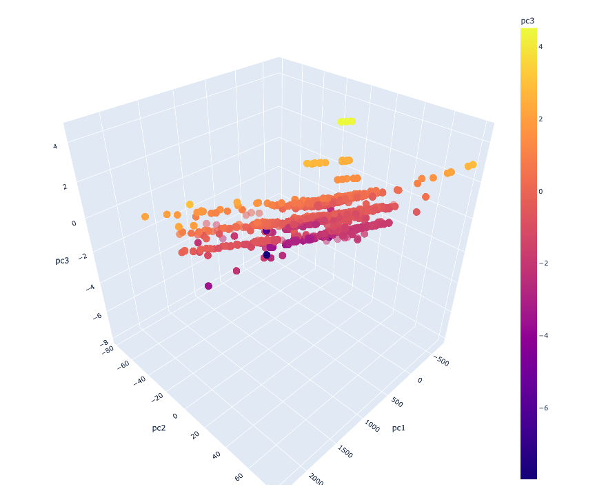
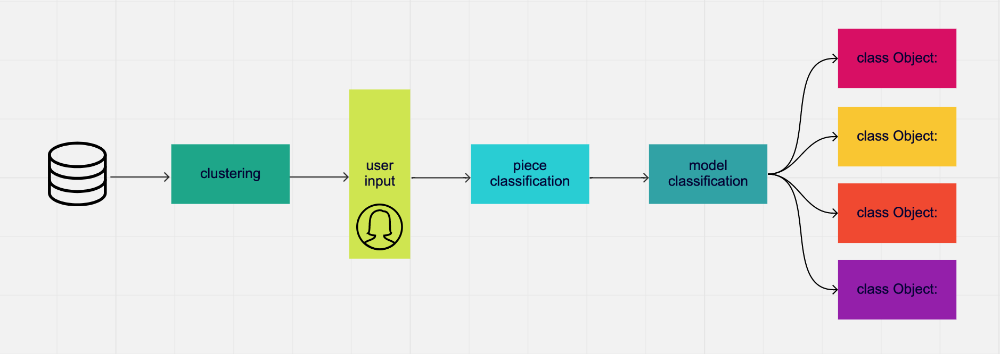

# Classification using CAD/CAM Pattern Metadata

### Objective
The objective of this project is to understand how metadata from Gerber Accumark CAD/CAM systems can be used to classify objects based on characteristics such as perimeter, area, number of internal lines, etc. 

### Data
The data used in this project is from two separate manufacturer's CAD/CAM systems. Identifying information has been removed. Initially this data was unlabeled, but by using web scraping and NLP ngram techniques I was able to label the dataset and, therefore, assess performance. I have not pushed this code to the repository because it contains private information. Also, the datasets are extremely large, some having up to 6 million records. One smaller, sample set is available for view in the public repo.

### EDA

Intitial data exploration revealed the beginnings of separability. The visualization below was created using the smallest dataset, and looks promising. Data for visualizations was decomposed using incremental PCA. Visualizing the classes, it's clear that they form clusters.

| cluster 1 | cluster 2 | cluster 3 |
| ------------- | ------------- | ------------- |
|    |    |    |


### Model Structure + Initial Findings
I ran 6 baseline classifiers on the first level of modeling and the performance ranged between 0.253 and 0.986 on F1 score on the test sets.
| Classifier | Train Accuracy | Train Precision | Train Recall | Train F1 Score | Test Accuracy | Test Precision | Test Recall | Test F1 Score | Test Time |
| --- | --- | --- | --- | --- | --- | --- | --- | --- | --- |
| Logistic Regression | 0.356 | 0.200 | 0.356 | 0.252 | 0.356 | 0.202 | 0.356 | 0.253 | 70.90 |
| KNearest Neighbors | 0.993 | 0.993 | 0.993 | 0.993 | 0.986 | 0.986 | 0.986 | 0.986 | 33.69 |
| Naive Bayes | 0.395 | 0.399 | 0.395 | 0.373 | 0.393 | 0.398 | 0.393 | 0.371 | 11.69 |
| Decision Tree | 0.529 | 0.517 | 0.529 | 0.486 | 0.528 | 0.517 | 0.528 | 0.485 | 14.52 |
| Random Forest | 0.538 | 0.517 | 0.538 | 0.492 | 0.537 | 0.515 | 0.537 | 0.491 | 17.35 |
| XGBoost | 0.976 | 0.976 | 0.976 | 0.976 | 0.969 | 0.969 | 0.969 | 0.969 | 302.54 |

However, due to the nature of the problem, this learning actually requires stacked models. Roughly, the form of the model is as illustrated:



More about the nature of the final model here.

### Results
At both the first and second level of modeling, I was able to acheive over 96% successful classification. The first model is the distance-based KNN algorithm, and it correctly classfies pieces 99% of the time, a result that remained consistent across crossvalidation sets. The second model is the boosted ensemble method XGBoost, and it correctly classified objects based on aggregated information from the first model, 82% of the time. After implementing NLP techniques, I was able to improve this performance to 96%-99%, depending on the collection.

### Limitations
The data in this project was restricted to that of 2 separate manufacturers and I would like to expand the source to make sure the algorithmic performace holds industry-wide. I was also severly limited by computational power at the first level of modeling - many of the data sets had millions of records. However, despite these limitations I feel that the sample I used to train this algorithm is representative.

### Next Steps
Over the next couple of months I will work to translate these patterns from classification parameters to formulas for development using object-oriented programming. I will also explore image-based machine learning to bolster the supply of material for training these algorithms.

I would like to apply a similar analysis across the other industries that utilize CAD/CAM cutting to see if similar patterns exist. 


## For More Information

See learn more please explore the Jupyter Notebooks in this repo or review this [presentation](./presentation.pdf).

For additional info, contact the author at:<br>
[Taylor Hale Robert](mailto:taylorhale11@gmail.com)


## Repository Structure

```
├── EDA.ipynb
├── modeling.ipynb
├── data
│   └── customer_churn.csv
├── images
│   ├── nguyen-dang-hoang-nhu-qDgTQOYk6B8-unsplash.jpg
│   ├── dom-fou-YRMWVcdyhmI-unsplash.jpg
│   ├── EDA.png
│   ├── EDA_1.png
│   ├── roc_auc.png
│   ├── important_features.png
│   └── baseline.png
├── .gitignore
├── README.md
└── presentation.pdf
 
